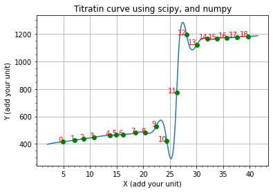

### jupyter-titration-curve
This notebook uses scipy make_interp_spline, to create a "smooth" curve, and numpy to find the possible equivalence points.
Made this during a chemistry course, and could not find a method that i liked to visualize the titration, and mark the equivalence point in python.

